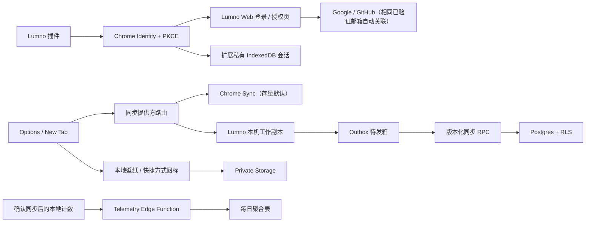

# Lumno 账号、同步与统计架构

更新日期：2026-08-03

## 1. 最终方案

Lumno 使用 Supabase Auth + Postgres + Private Storage + Edge Functions，并保持 local-first：

- 登录身份和同步提供方是两个状态：未选择 Lumno 同步时继续使用原有的 `chrome.storage.sync`；选择 Lumno 后改用 `chrome.storage.local` 作为本机工作副本，再通过 Outbox 异步写入 Postgres。
- Chrome Sync 与 Lumno Sync 同一时间只能有一个接收新写入。禁止长期双写；未启用的远端保留切换前快照，但不会继续变化。
- 自定义壁纸保存在本地 IndexedDB，自定义快捷方式图标保存在本地扩展存储；两者都上传到用户私有 Storage 目录。
- 插件在跳转网页登录前一次性披露同步和统计范围；用户确认并完成登录后，同时启用账号同步和每日聚合使用统计，不再提供独立统计开关。
- Access Token、Refresh Token 只放扩展源私有的 IndexedDB；设备 ID、冲突和待发队列放 `chrome.storage.local`，均不进入浏览器同步。

## 2. 数据分类

### A. 账号识别数据

- 邮箱
- Supabase 生成的用户 ID
- Lumno 生成的设备 ID
- 插件版本、浏览器家族、粗粒度平台类型

用途仅限登录、安全、跨设备同步和故障定位。

### B. 同步配置

同步功能需要完整配置，因此其中可能包含用户主动设置的快捷方式 URL、名称和黑名单规则。它们只走同步通道，不会进入统计通道。

### C. 媒体资源

- 用户主动导入的壁纸原图和缩略图
- 用户主动导入的快捷方式自定义图标
- 原始显示名称、MIME、尺寸、字节数、SHA-256

上传前，壁纸源文件最多 25 MiB，并在客户端重新编码为 WebP（云端主图最多 2 MiB、缩略图最多 160 KiB）；快捷方式图标源文件最多 10 MiB，并重新渲染为 128×128 PNG（最多 96 KiB）。原始 EXIF、文件名内嵌内容和非图片尾随数据不会直接进入云端。单用户最多保存 20 张壁纸和 20 个快捷方式图标，活跃媒体合计最多 48 MiB。对象路径由服务端生成、以用户 ID 开头，Bucket 不公开。

按全部文件都达到上限计算：`20 × (2 MiB + 160 KiB) + 20 × 96 KiB = 45 MiB`，低于 48 MiB 服务端总配额，留出的 3 MiB 用于编码和边界误差；配额按服务端收到的真实字节计算，不采用客户端声明值。

客户端限制只负责体验，不能作为安全边界。`media-asset` Edge Function 会根据实际二进制重新检查格式、结构、尺寸和字节数，计算 SHA-256，再把已压缩主图发送给 Sightengine，同时执行色情、赌博/毒品、暴力/血腥/武器/自残和图片文字混淆检测；只有完整的低风险响应才以 Service Role 写入 Storage 和 metadata。生产环境未配置审核服务、审核超时、返回字段不完整或审核不通过时，上传失败关闭；不会把“扩展名/MIME 看起来像图片”当成内容安全判断。

媒体资源另有 30 次/账号/小时的上传限制和 512 MiB/账号/月的下载预算。审核端按 Sightengine Free 的 4 个计费模型组做全局串行预算：最多 100 张/UTC 日、450 张/UTC 月，并保留免费额度余量；触及速率或预算就返回 429，不自动切换付费。认证客户端没有 Storage 写入、删除或直接下载权限，也不能修改 `lumno_assets`；因此自定义客户端无法通过伪造 metadata、先写后删或任意路径把 Bucket 当网盘。

### D. 随账号同步启用的使用统计

用户在插件内确认同步与统计范围并完成网页登录后，客户端才开始记录和上传白名单计数，例如命令栏唤起、新标签页打开、搜索类型和同步结果。配置快照会被压缩成：

- 布尔值，例如是否启用画中画；
- 枚举，例如浅色/深色；
- 数量或数量区间，例如快捷方式数量。

明确禁止 URL、域名、路径、搜索词、网页标题、历史记录、书签内容、邮箱、Cookie 和 Token。

账号关联的每日明细和配置属性最多保留 24 个月。到期前，数据库只按“月份 + 功能指标”累加长期总次数；长期表不保存用户 ID、设备 ID、邮箱或配置属性。统计上传的去重批次保留 30 天，同步写入的幂等操作记录保留 90 天。

## 3. 同步如何避免覆盖

每个配置键在云端有独立 `version`。客户端修改时携带自己看到的 `base_version`：

1. 版本一致：原子更新并将版本加一。
2. 版本不一致：服务端不覆盖，客户端从 Outbox 摘除旧操作以终止重试死循环；双方值进入去重冲突记录，当前工作值先采用服务端版本。
3. 网络超时重试：同一个 `operation_id` 只执行一次。
4. 多键批量写入：按键名排序，降低数据库死锁概率。

这分别对应 Optimistic Concurrency、Idempotency 和 Deterministic Lock Ordering。可以把它们理解为“对稿版本号”“快递单号”和“所有人按同一顺序排队”。

用户后续选择“保留此设备版本”时，客户端会用服务端最新版本号创建一张新的修改单；选择“保留云端版本”则关闭冲突记录。标量配置不做字段级魔法合并，数组或对象也不会在不了解业务语义时自动拼接。

## 4. Chrome 与 Lumno 之间的迁移

### Chrome → Lumno

1. 从 Chrome Sync 读取同步白名单内的设置，未知键和本机私有状态不会打包。
2. 写入 Lumno 的本机工作副本并原子切换提供方。
3. 先拉取账号远端版本，再通过版本化 Outbox 上传本机新增或用户决定保留的值。
4. 自定义壁纸从本机 IndexedDB 单独上传到私有 Storage，不塞进配置 JSON。

### Lumno → Chrome

允许迁回，但不是后台双写：先完成一次 Lumno 拉取并确认没有无法处理的网络错误，再生成 Chrome 兼容快照。写入前按 Chrome Sync 的 8 KiB/项、100 KiB/总量、512 项限制检查；超限时阻止切换并返回报告，不静默截断。壁纸二进制不进入 Chrome Sync，只保留在当前设备或由用户另行导出。

可以把提供方切换理解成“换银行”：迁移时结清并验账，之后只在新银行记账；不会让两家银行永久替你同时扣款。

## 5. 安全边界

| 边界 | 机制 | 防止的问题 |
| --- | --- | --- |
| 插件包 | 只包含 Publishable Key | 反编译后不会泄露后台总钥匙 |
| 网页到插件 | OAuth 2.1 Authorization Code + PKCE + state + 精确回调 URI | 网页不能直接把 Token 注入插件，截获授权码也无法兑换 |
| 用户会话 | Token 仅存扩展源私有 IndexedDB | Token 不随浏览器账号同步，内容脚本也不能直接读取 |
| 插件消息 | 只接受同扩展 ID、同 `chrome-extension://` 源的账号动作 | 普通网页和内容脚本不能触发登录、退出或同步操作；插件不提供删除账号接口 |
| 数据库 | 所有业务表启用并强制 RLS | 用户不能读写别人的行 |
| 配置写入 | 只允许受控 RPC | 客户端不能绕过版本检查 |
| 媒体上传 | 客户端重编码 + Edge 网关 + 实际字节/尺寸复核 + 内容审核 + 数量/容量/速率配额 | 不能越权写路径、伪造 MIME、无限上传或把服务当网盘 |
| 媒体下载 | Edge 网关 + metadata 所有权检查 + 月度出站预算 | 不能绕过计费边界批量消耗 Storage 流量 |
| 开源仓库 | 商店包仅打包 `src/_locales/assets`，剥离开发 key/debug 连接；仓库和客户端仅含 Publishable Key | 开源代码不会暴露 Service Role、数据库密码或部署资产 |
| 统计入口 | 客户端、Edge Function、数据库三层白名单 | 即使一层出错也不接收浏览内容 |
| 管理权限 | Secret/Service Role 仅在 Edge Function | 插件永远拿不到 RLS 绕过权限 |

## 6. 生命周期与服务故障

MV3 Service Worker 会休眠，不能依赖常驻 WebSocket。实现使用：

- 设置变更后约 1 秒尝试同步；
- 1 分钟 one-shot alarm 兜底；
- 15 分钟 periodic alarm 补偿；
- 浏览器启动或后台被唤醒时再次同步；
- 所有操作先写本地，因此网络失败不阻塞 UI。
- 每次 Supabase 请求最多等待 15 秒；网络故障按 30 秒起步指数退避，最长 15 分钟，用户手动同步可绕过冷却重试。
- Supabase 故障时不自动回退 Chrome Sync，避免两套远端各自产生新历史；本机继续可用，待发修改留在 Outbox。

## 7. 冲突与删除语义

- 配置采用“云端已变化时不静默覆盖”，冲突按配置键去重并保留双方版本；失败操作不会永远重试。
- 首次登录先拉云端，再把合并后的本机快照补齐到云端；已存在键以云端为准，本机独有键会上传。
- 壁纸是不可变导入项：每次导入生成新 ID，不做同 ID 的图片编辑。
- 删除壁纸先删 Storage 对象，再把 metadata 标为墓碑；其他设备同步到墓碑后删除本机 IndexedDB 副本，避免长期离线设备把旧资源复活。墓碑保留到账号删除。
- 删除账号只能在已认证的 Lumno Web 账号中心完成。Web 调用 Edge Function，递归枚举并清理该 `user_id/` 下的全部对象（包括未来目录、旧路径和无引用对象），再删除 Auth 用户；数据库行通过外键级联清理。插件只有跳转链接，没有直接删除能力。
- 退出登录不会删除本机配置；永久删除账号也保留本机配置，方便用户继续使用游客模式。

## 8. 主要风险和控制

| 风险 | 当前控制 | 仍需运营决定 |
| --- | --- | --- |
| OAuth 回调被劫持 | 每个扩展环境独立公共 Client ID、精确 `chromiumapp.org` 回调、PKCE/state | 发布新渠道时必须单独注册客户端，不能复用模糊回调 |
| 社交账号供应链 | Google 与 GitHub 只申请基本身份；插件不接触第三方密码和第三方 Token；Google 品牌已验证并显示 Lumno | 后续若修改名称、图标、首页、隐私链接或回调域名，需重新评估品牌验证 |
| 同邮箱身份关联 | 仅依赖 Supabase 对已验证邮箱的自动身份关联；相同邮箱共享同一个用户 ID 和同一份同步数据 | 不提供不同邮箱账号的手工合并；身份提供商邮箱变化时需做账号恢复评估 |
| 跨境与地区合规 | 本地优先；隐私政策面向所有用户披露东京区域、境外接收方、数据类型、目的和权利 | 服务地区、处理规模或接收方变化时重新评估适用法律；若大陆性能是硬指标，再评估 CloudBase |
| 云服务暂停/故障 | 15 秒超时、指数退避、本机 Outbox；不自动双写 Chrome | 生产付费计划、异地数据库导出、恢复演练与可用性监控 |
| 配置包含敏感 URL | 只用于用户主动同步、RLS 隔离 | 隐私政策必须明确披露，不得复用于统计 |
| 非扩展用途或违法图片 | 固定图片格式、48 MiB 总配额、上传/下载预算、Sightengine 多模型审核、全局免费额度闸门、失败关闭 | 每次发布前抽样检查误杀/漏判；处理区域或保留政策变化时更新隐私披露 |
| 开源代码被二次打包 | 公共客户端标识不视为秘密；所有授权、配额和内容判断在服务端；商店包不包含后端/部署文件 | 外部贡献者或 CI 若需端到端云测试，应使用独立 Supabase 开发项目，禁止给生产 Service Role |
| 统计口径膨胀 | 固定白名单、未知字段拒绝 | 新指标必须经过隐私评审和 schema 变更 |
| 多设备冲突体验 | 不静默覆盖，保存冲突 | 后续增加逐项冲突 UI |
| 账号枚举/暴力请求 | Auth 速率限制，错误文案不暴露账号存在 | 上线后观察 Auth 日志并调限额 |

## 9. 方案比较

| 方案 | 优点 | 缺点 | 结论 |
| --- | --- | --- | --- |
| Supabase | Auth、Postgres、RLS、Storage、Functions 一体；现有同步版本语义能直接落在 SQL/RPC | 当前托管区域列表没有中国大陆区域；需配置生产 SMTP | 当前首选 |
| Firebase | 官方支持 Manifest V3 Auth，Firestore Web 有离线持久化，Storage 有用户级安全规则 | 默认同文档离线冲突是 last-write-wins；要保留 Lumno 的显式版本冲突仍需自建协议 | 若团队已深度使用 GCP 可选 |
| CloudBase | 身份、数据库、云存储、函数一体；PG 模式 Storage 也可走 RLS | 需要重写并重新审计当前 Supabase RPC、Edge Function 和传输层 | 中国大陆部署是硬指标时先做网络与合规 PoC |
| 自建 API + Postgres + S3 | 自由度最高，可完全控制数据位置 | Auth、邮件、安全更新、备份、容灾和值班全部自担 | 现阶段不建议 |

官方能力依据：[Supabase 可用区域](https://supabase.com/docs/guides/platform/regions) 与[自托管责任](https://supabase.com/docs/guides/self-hosting)、[Firebase MV3 Auth](https://firebase.google.com/docs/auth/web/chrome-extension)、[Firestore 离线与冲突语义](https://firebase.google.com/docs/firestore/manage-data/enable-offline)、[Firebase Storage 安全规则](https://firebase.google.com/docs/storage/security/rules-conditions)、[CloudBase 身份认证](https://docs.cloudbase.net/authentication/auth/introduce) 与[PG 模式云存储](https://docs.cloudbase.net/storage/pg/introduce)。

## 10. 关键文件

- `src/shared/cloud-sync-schema.js`：唯一数据合同和统计白名单。
- `src/shared/cloud-sync-state.js`：Outbox、版本和冲突纯逻辑。
- `src/background/cloud-account-controller.js`：MV3 生命周期和账号编排。
- `src/background/web-auth-flow.js`：OAuth 2.1 Authorization Code、PKCE、state 和 Chrome 回调校验。
- `src/background/secure-session-store.js`：扩展源私有 IndexedDB 会话存储和旧会话迁移。
- `src/background/supabase-transport.js`：Auth、REST 和 Edge Functions HTTPS 传输；认证客户端不直连 Storage。
- `src/background/cloud-wallpaper-runtime.js`：用户媒体同步；负责壁纸 IndexedDB 与快捷方式图标本地存储的上传、下载、删除和账号隔离。
- `src/background/usage-analytics-runtime.js`：同意门和每日计数器。
- `supabase/migrations/202608010001_lumno_cloud.sql`：表、索引、RLS、RPC 和 Storage 策略。
- `supabase/migrations/202608020002_data_retention.sql`：24 个月明细保留、匿名月度汇总以及 30/90 天幂等记录清理。
- `supabase/migrations/202608020005_full_configuration_and_media_assets.sql`：补齐配置白名单，并为壁纸和快捷方式图标建立分类型媒体约束与独立配额。
- `supabase/migrations/202608030006_media_gateway_and_resource_limits.sql`：撤销客户端媒体/设备写权限，加入 48 MiB 媒体总量、速率/出站预算、10 台设备和 JSONB 大小/深度限制。
- `supabase/migrations/202608020004_mainland_cross_border_consent.sql`：保留已部署的历史同意字段；当前客户端不再展示或写入地区专属同意。
- `supabase/functions/`：统计入口、媒体上传/下载/删除网关与账号删除。

## 11. 生产验收记录

- 2026-08-02：Google Web 登录已使用真实测试账号完成，Web 正确显示 Google 身份和邮箱。
- 2026-08-02：从开发版扩展发起 OAuth 2.1 + PKCE 授权后，成功返回扩展并显示同一账号。
- 2026-08-02：账号连接流程改为插件内先确认同步与统计范围，再进入网页登录；授权成功后两者同时启用，独立统计开关移除。
- 2026-08-02：Google OAuth 已发布为正式版；Lumno 名称、图标、首页和隐私政策通过品牌验证并发布。真实登录页已确认显示 Lumno，不再以 Supabase 项目域名作为应用名称。

## 12. 变更规则

以后新增一个设置键或统计指标时，必须同时回答：

1. 它属于同步数据还是统计数据？
2. 是否包含用户内容、URL 或可识别信息？
3. 客户端、Edge Function 和数据库白名单是否一致？
4. 隐私政策和产品内披露是否要更新？
5. 撤回同意或删除账号时如何清理？

若回答不完整，不应发布该指标。
